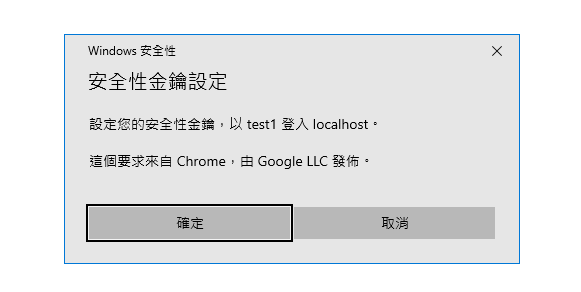
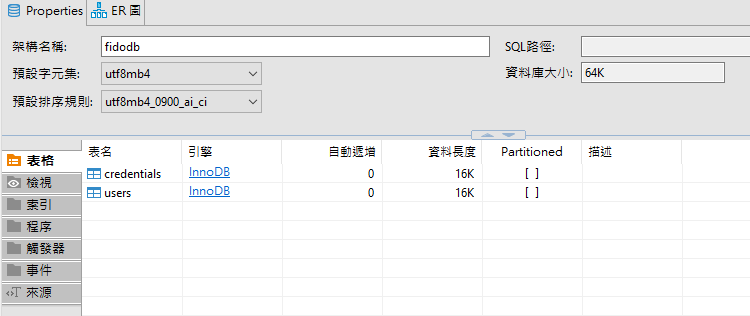

# FIDO2 小小作業練習

這是一個微型小作業，提供給大家使用

本項目只包含了一個fido2 資料庫

## 你的任務：

1. 撰寫一個可以驅動FIDO Key 的網頁前端

    https://blog.techbridge.cc/2019/08/17/webauthn-intro/

    你會看到的畫面：

    前端有跑出這個咚咚舊型嘞

    

    | 完成清單      |
    | ------------ |
    | ✔️ 智仁大佬  |
    | ✔️ 宇鈞大哥  |

2. 撰寫一個可以接收 FIDO Key 註冊 的伺服器端(語言不限)

    上一篇文章所提到publicKeyCredentialCreationOptions 變數，將改由後端發出

    FIDO2 Server 此階段會出現的API

    註冊開始 : POST http://localhost:<自己定義的port>/webauth/register/begin

    註冊開始時，會傳送username給後端，後端回傳publicKeyCredentialCreationOptions資訊提供給前端註冊

    註冊完成：POST http://localhost:<自己定義的port>/webauth/register/complete 
    註冊完成後，將產生的結果拋回後端

    | 完成清單      |
    | ------------ |
    | ✔️ 智仁大佬  |
    | ✔️ 宇鈞大哥  |

    ### 相關參考連結：

    Python : https://github.com/Yubico/python-fido2

    Express : https://webauthn.passwordless.id/authentication/

    GO : https://github.com/hbolimovsky/webauthn-example

    ### 什麼是 Restful API ? 

    GET POST UPDATE DELETE 

    https://mtache.com/rest-api

    ```
        之後會開幾個分支，會有這邊程式碼的範例(不同語言的)
    ```

4. 將資料存入Database 之中

    你的任務是把剛剛送到的資料傳給資料庫儲存。

    http://localhost:<自己定義的port>/webauth/register/complete 執行完畢後，將資料存入DB

    本範例提供了一個資料庫可以使用

    * 必須安裝 docker

        https://www.docker.com/

    ### How to use

    ```
        docker-compose build  //docker 建置
        docker-compose up -d // docker 運行 -d 是背景執行的意思
    ```

    系統移除，如果想要重新build資訊的話使用
    ```
        docker-compose down -v 
    ```

    裡面會有兩個database 

    (下面這個畫面是DBeaver 資料庫圖形化顯示軟體的東西，如果想方便自己看資料可以裝)
    

    User 的資料表為

    | id | username | info |
    | -- | -- | -- | 
    | id | 使用者名稱 | 資訊(隨便打 幫自己記住的小東西，可以是null值) |

    credentials 的資料表為

    | i id | username | publicKey | algo |
    | -- | -- | -- | --  |
    | id | 使用者名稱 | 公鑰 | 演算法 |

    | 完成清單      |
    | ------------ |
    | ✔️ 宇鈞大哥  |
5. 進行登入

使用者要進行登入了，傳送 username 給後端，後端針對這個user從資料庫取出相關資料
傳送給前端
可能會開的API : 

http://localhost:<自己定義的port>/webauth/login/begin

前端拿著此東西進行FIDO Key 登入，再把資料傳回給後端

http://localhost:<自己定義的port>/webauth/login/complete 

成功!


